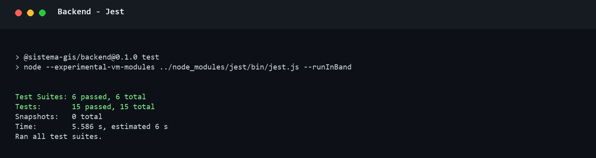
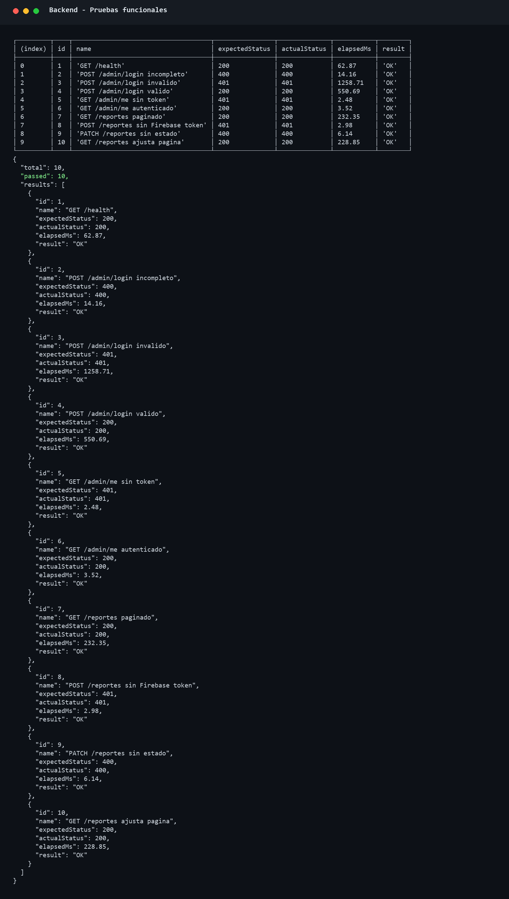
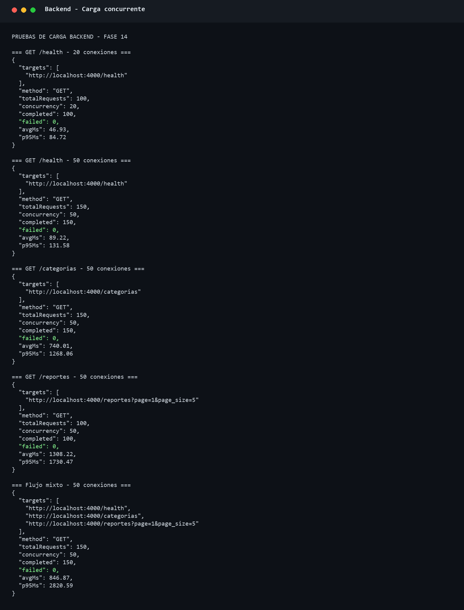
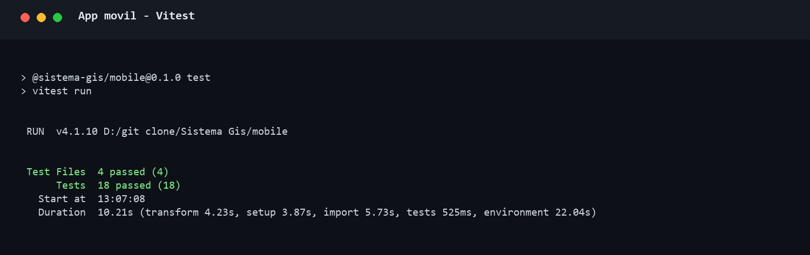
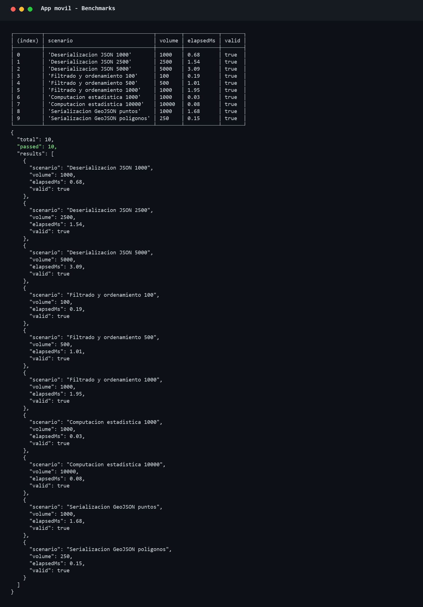
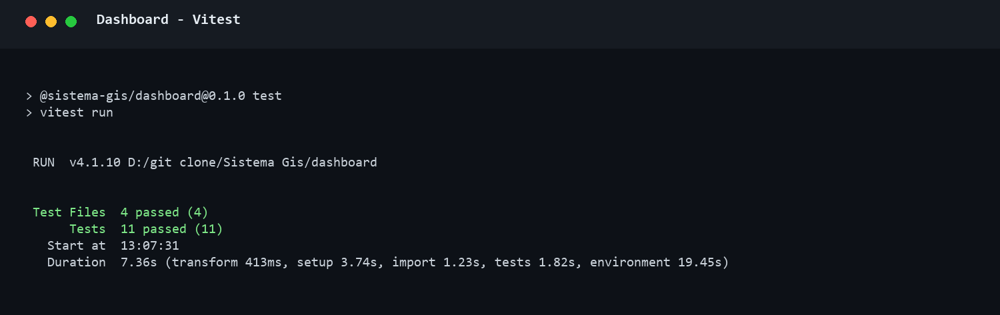

# Fase 14 - Correccion de validacion y pruebas trazadas con la tesis

## Alcance

Esta fase corrige la validacion administrativa de reportes y amplia las pruebas de
backend, aplicacion movil y dashboard tomando como referencia las tablas de la
seccion 3.4 de la tesis.

La tesis menciona 39 casos, pero sus tres tablas contienen 15 casos de backend,
18 casos moviles y 11 casos de dashboard. Esto suma 44 casos. Para conservar la
trazabilidad con las tablas, se ejecutaron y reportaron los 44 casos.

La aplicacion actual usa Ionic React con Capacitor, no Flutter. Por ello, los casos
moviles conservan las categorias, volumenes y cinco columnas de la tabla original,
pero prueban la implementacion real vigente.

## Correccion de Validar

El error interno se originaba en la inferencia de tipos de PostgreSQL. El parametro
de estado se utilizaba simultaneamente en la asignacion y en expresiones `CASE`.
La consulta ahora convierte explicitamente estado a `varchar`, zona e identificador
administrativo a `integer`.

Se verifico la transicion completa dentro de una transaccion reversible y luego se
valido realmente el reporte `#43`. Resultado final: `validado`.

## Resultados del Backend

La tabla conserva las seis columnas de la tesis.

| ID | Tipo de Prueba / Endpoint | Concurrencia | Lo que valida / Metrica Evaluada | Resultado | Tiempo Promedio |
|---:|---|---|---|---|---:|
| 1 | GET `/health` (Funcional) | N/A | Estado esperado 200 | OK | 62.87 ms |
| 2 | POST `/admin/login` incompleto (Funcional) | N/A | Estado esperado 400 por campos incompletos | OK | 14.16 ms |
| 3 | POST `/admin/login` invalido (Funcional) | N/A | Estado esperado 401 | OK | 1258.71 ms |
| 4 | POST `/admin/login` valido (Funcional) | N/A | Estado 200 y retorno de JWT | OK | 550.69 ms |
| 5 | GET `/admin/me` sin token (Funcional) | N/A | Rechazo esperado 401 | OK | 2.48 ms |
| 6 | GET `/admin/me` autenticado (Funcional) | N/A | Estado 200 y sesion administrativa | OK | 3.52 ms |
| 7 | GET `/reportes` paginado (Funcional) | N/A | Estado 200, datos y metadatos de paginacion | OK | 232.35 ms |
| 8 | POST `/reportes` sin Firebase token (Funcional) | N/A | Rechazo esperado 401 | OK | 2.98 ms |
| 9 | PATCH `/reportes/43/estado` sin estado (Funcional) | N/A | Estado esperado 400 sin modificar el reporte | OK | 6.14 ms |
| 10 | GET `/reportes?page=999` (Funcional) | N/A | Ajuste automatico a una pagina existente | OK | 228.85 ms |
| 11 | GET `/health` (Carga) | 20 conexiones | 100 solicitudes, 0 errores | OK | 46.93 ms |
| 12 | GET `/health` (Carga) | 50 conexiones | 150 solicitudes, 0 errores | OK | 89.22 ms |
| 13 | GET `/categorias` (Carga) | 50 conexiones | 150 solicitudes, 0 errores; supera referencia temporal | OBS. | 740.01 ms |
| 14 | GET `/reportes` (Carga) | 50 conexiones | 100 solicitudes, 0 errores; supera referencia temporal | OBS. | 1308.22 ms |
| 15 | Flujo mixto (Carga) | 50 conexiones | 150 solicitudes, 0 errores; supera referencia temporal | OBS. | 846.87 ms |

Resultado automatizado Jest: **15/15 pruebas aprobadas**.

Las cinco cargas terminaron con **0 solicitudes fallidas**. Los tres casos marcados
`OBS.` requieren optimizacion o una medicion contra una base desplegada en la misma
red antes de afirmar el SLA temporal descrito en la tesis.

## Resultados de la Aplicacion Movil

La tabla conserva las cinco columnas de la tesis.

| Categoria de Prueba | Descripcion del Escenario Evaluado | Volumen de Control | Metrica de Tiempo | Estado |
|---|---|---:|---:|---|
| Interfaz | Pantalla de bienvenida renderiza acceso con Google | N/A | N/A | OK |
| Interfaz | Inicio muestra Nuevo reporte, Mis reportes y Emergencia | N/A | N/A | OK |
| Interfaz | Emergencia muestra cuatro contactos de asistencia | 4 contactos | N/A | OK |
| Interfaz | Detalle muestra estado, urgencia y descripcion | 1 reporte | N/A | OK |
| Interfaz | Nuevo reporte carga categorias y acciones GPS/camara | 1 formulario | N/A | OK |
| Unidad | Servicio excluye categorias inactivas | 2 categorias | N/A | OK |
| Unidad | Creacion envia token Firebase y coordenadas | 1 payload | N/A | OK |
| Unidad | Mis reportes usa identidad del ciudadano autenticado | 1 respuesta | N/A | OK |
| Rendimiento | Deserializacion JSON de reportes | 1,000 registros | 0.68 ms promedio | OK |
| Rendimiento | Deserializacion JSON de reportes | 2,500 registros | 1.54 ms promedio | OK |
| Rendimiento | Deserializacion JSON de reportes | 5,000 registros | 3.09 ms promedio | OK |
| Rendimiento | Filtrado y ordenamiento cronologico | 100 registros | 0.19 ms promedio | OK |
| Rendimiento | Filtrado y ordenamiento cronologico | 500 registros | 1.01 ms promedio | OK |
| Rendimiento | Filtrado y ordenamiento cronologico | 1,000 registros | 1.95 ms promedio | OK |
| Rendimiento | Computacion estadistica | 1,000 valores | 0.03 ms promedio | OK |
| Rendimiento | Computacion estadistica | 10,000 valores | 0.08 ms promedio | OK |
| Rendimiento | Serializacion de puntos a GeoJSON | 1,000 puntos | 1.68 ms promedio | OK |
| Rendimiento | Serializacion de poligonos GeoJSON | 250 poligonos | 0.15 ms promedio | OK |

Resultado automatizado Vitest: **18/18 pruebas aprobadas**.

Los benchmarks usan una ejecucion de calentamiento y cinco iteraciones medidas para
evitar atribuir al algoritmo el costo inicial del motor JavaScript.

## Resultados del Dashboard React

La tabla conserva las cuatro columnas de la tesis.

| ID | Componente / Interaccion Evaluada | Criterio de Aceptacion y Validacion del DOM | Estado |
|---:|---|---|---|
| 1 | Analisis estadistico | Presenta preguntas de gestion y selecciona internamente la prueba | OK |
| 2 | Filtros y lupa | Cambia filtros y ejecuta Aplicar filtros | OK |
| 3 | Tabla de reportes | Ejecuta estado, abre detalle y cambia pagina | OK |
| 4 | Formulario de login | Renderiza Usuario, Contrasena e Ingresar | OK |
| 5 | Envio de login | Entrega las credenciales escritas al flujo de autenticacion | OK |
| 6 | Actualizacion | El boton Actualizar ejecuta la recarga | OK |
| 7 | Exportacion CSV | El boton Exportar ejecuta la descarga | OK |
| 8 | Tamano de pagina | Permite cambiar de 5 a 10 o 25 filas | OK |
| 9 | Navegacion paginada | Desactiva Pagina anterior en la primera pagina | OK |
| 10 | Detalle de reporte | Abre y cierra el dialogo accesible | OK |
| 11 | Carga masiva del DOM | Renderiza 25 filas bajo presupuesto de 1000 ms | OK |

Resultado automatizado Vitest: **11/11 pruebas aprobadas**.

## Consolidado

| Componente | Casos definidos por la tabla de tesis | Aprobados |
|---|---:|---:|
| Backend | 15 | 15 |
| Aplicacion movil | 18 | 18 |
| Dashboard React | 11 | 11 |
| **Total** | **44** | **44** |

Las pruebas automatizadas alcanzaron **44/44 casos aprobados**. Las observaciones de
carga no representan errores HTTP: registraron 0% de fallos, pero muestran una
oportunidad real de optimizacion temporal en consultas que acceden a la base remota.

## Evidencias de Consola

### Backend - Jest

### Backend - Pruebas funcionales

### Backend - Carga concurrente

### Aplicacion movil - Vitest

### Aplicacion movil - Benchmarks

### Dashboard - Vitest

Los archivos `.txt` de cada ejecucion se conservan en la misma carpeta para revision
y trazabilidad.
